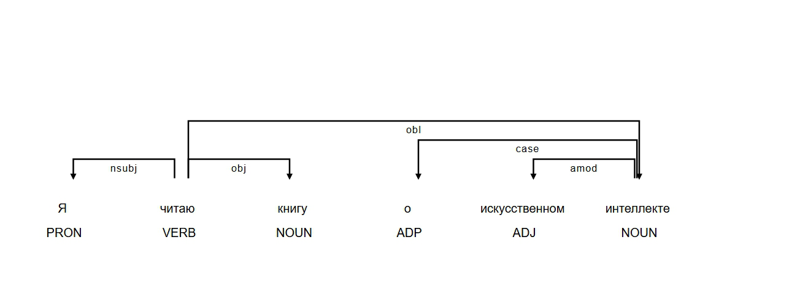
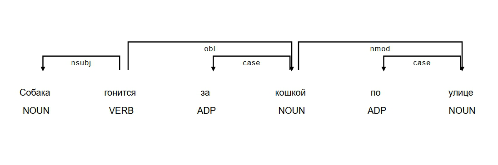
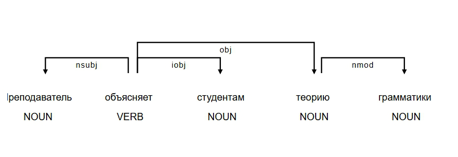

俄语句法结构可视化分析报告

1：Я читаю книгу о искусственном интеллекте

1. 句法结构
- 核心动词：читать（“ читаю” 是其第一人称单数形式）→ 支配关系：“Я” 作为动作执行者（主语），“книгу” 是动作的直接承受对象（第四格直接宾语），“о искусственном интеллекте” 是关于书籍内容的补充说明，通过介词 “о” 引导，作动词的补语。
- 修饰关系：“о искусственном интеллекте” 修饰 “книгу”（通过`内容修饰关系`连接），说明书籍的主题内容；不存在其他修饰关系。
2. 形态特征
- 关键词语形分析：
    - “Я”：第一人称单数主格形式，在句子中作主语，表示动作的发出者。
    - “ читаю”：动词现在时第一人称单数形式，与主语 “Я” 在数和人称上保持一致。
    - “книгу”：阴性、单数、第四格，作动词 “читать” 的直接宾语，是动作的承受者。
    - “о искусственном интеллекте”：“технике” 是阴性、单数、第六格，与介词 “о” 搭配，“искусственном” 是 “искусственный” 的中性、单数、第六格形式，“интеллекте” 是 “интеллект” 的阳性、单数、第六格形式，共同构成关于书籍内容的补语。
- 形态 - 句法接口：
    - 格位在句子中起到关键作用。第四格 “книгу” 用于表示及物动词 “читать” 的直接宾语；第六格 “искусственном интеллекте” 与介词 “о” 搭配，用来补充说明书籍的内容相关信息。格位的变化决定了词语在句子中与其他成分（如动词、介词）的组合方式，影响着句子的语义表达和句法功能。

3. 计算启示
- 规则设计建议：
    - 在设计句法分析规则时，要完善及物动词与其直接宾语的格位匹配规则，确保能准确识别第四格直接宾语与及物动词的关系。
    - 对于介词与格位的搭配规则，要建立更细致的规则体系，如 “о + 第六格” 表示关于某方面的内容等，以便更准确地分析句子的语义结构。
- 模型优化方向：
    - 增加对第一人称单数形式动词的特征学习，使模型能够更准确地处理主语为第一人称时句子的句法分析。
    - 针对介词短语作补语的情况，丰富训练数据，让模型更好地理解不同介词短语在句子中所表达的语义功能，提高对这类句子的分析准确性。

2.Собака гонится за кошкой по улице

1. 句法结构
- 核心动词：гонять（“гонится” 是其反身形式）→ 支配关系：“Собака” 作为动作执行者（主语），“кошкой” 是被追逐的对象，通过介词 “за” 引导，作动词的补语 。
- 修饰关系：“по улице” 是地点状语，修饰动词 “гонится”（通过`地点修饰关系`连接）；“за кошкой” 是方式状语（表示动作的方向），修饰 “гонится”（通过`方式修饰关系`连接）。
- 特殊结构：此句包含反身动词结构 “гонится”，表示动作的主体自身进行的动作，即狗自己在进行追逐的动作

2. 形态特征
- 关键词语形分析：
    - “Собака”：阴性、单数、主格，在句子中作主语，表明动作的发出者。
    - “гонится”：动词现在时第三人称单数反身形式，与主语 “Собака” 在数和人称上保持一致，同时体现反身意义。
    - “кошкой”：阴性、单数、第五格，在介词 “за” 后，充当补语成分，表示追逐的对象。
    - “по улице”：“улице” 是阴性、单数、第六格，与介词 “по” 搭配，构成地点状语，说明动作发生的地点。
- 形态 - 句法接口：
    - 此句中格位和介词紧密相关。例如，第五格 “кошкой” 与介词 “за” 搭配表示 “追逐的对象” 这一语义关系；第六格 “улице” 与介词 “по” 搭配表示 “在……街道上” 的地点关系。格位的变化决定了词语在句子中与其他成分（如介词）的组合方式，进而影响句子的语义表达和句法功能。

3. 计算启示
- 规则设计建议：
    - 在设计句法分析规则时，要着重考虑反身动词的特殊规则，明确反身动词的形态变化以及其在句子中与其他成分的语义关系和句法功能。
    - 对于介词和格位的搭配规则，应建立详细的规则库，以便准确识别不同介词与格位组合所表达的语义，如 “за + 第五格” 表示追逐对象，“по + 第六格” 表示地点等。
- 模型优化方向：
    - 可以增加对反身动词结构的特征提取和学习，使模型能够更好地识别和处理反身动词在句子中的情况。
    - 针对介词与格位搭配的复杂情况，引入更多的训练数据，优化模型对介词格位组合的理解和判断能力，提高句法分析的准确性。

3.Преподаватель объясняет студентам теорию грамматики

1. 句法结构
- 核心动词：объяснять → 支配关系：支配第三格间接宾语“студентам”和第四格直接宾语“теорию грамматики”
- 修饰关系：“грамматики” → “теорию”（通过`所属关系`连接）

2. 形态特征
- 关键词语形分析：
    - “Преподаватель”：阳性、单数、主格，在句子中作主语，是动作的执行者。
    - “объясняет”：动词第三人称单数形式，与主语“Преподаватель”在数和人称上保持一致。
    - “студентам”：阳性、复数、第三格，作为间接宾语，表明动作的对象。
    - “теорию”：阴性、单数、第四格，作为直接宾语，是动作的承受对象。
    - “грамматики”：阴性、单数、第二格，用于修饰“теорию”，表示所属关系。
- 形态 - 句法接口：此句中格位决定了词语在句子中的句法功能。例如，第三格“студентам”用于表示动词“объяснять”动作的对象，第四格“теорию”用于表示动作的直接承受者，第二格“грамматики”用于修饰名词“теорию”，表明所属关系。

 3. 计算启示
- 规则设计建议：
    - 在规则设计中，需要明确动词支配的格位规则。对于像“объяснять”这类动词，要准确识别其支配第三格间接宾语和第四格直接宾语的规则。
    - 增加对修饰关系的规则识别，特别是第二格修饰名词表示所属关系的规则。
- 模型优化方向：
    - 增加格位特征嵌入，让模型能够更好地学习和理解词语格位与句法功能之间的关系。
    - 引入更多的动词支配模式，提高模型对不同动词支配关系的识别能力。

